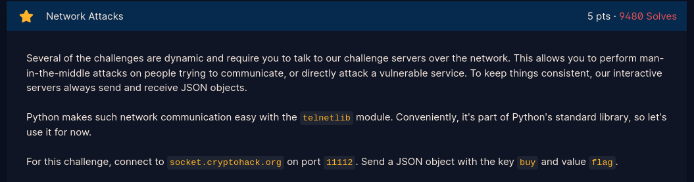
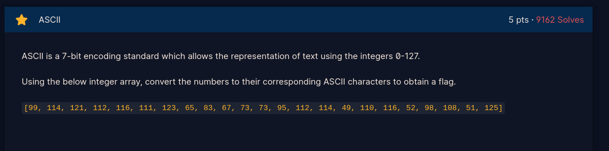
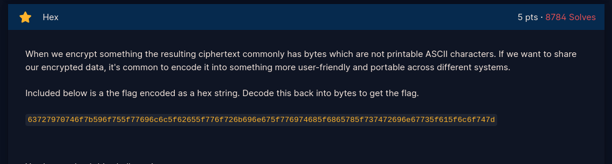
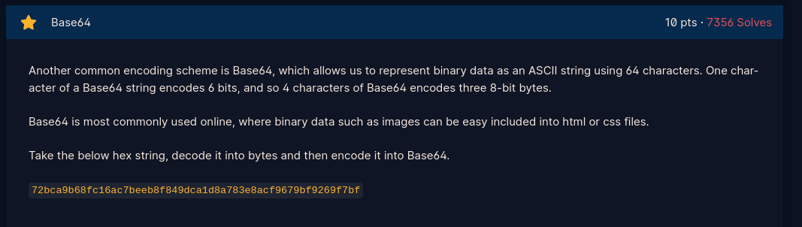
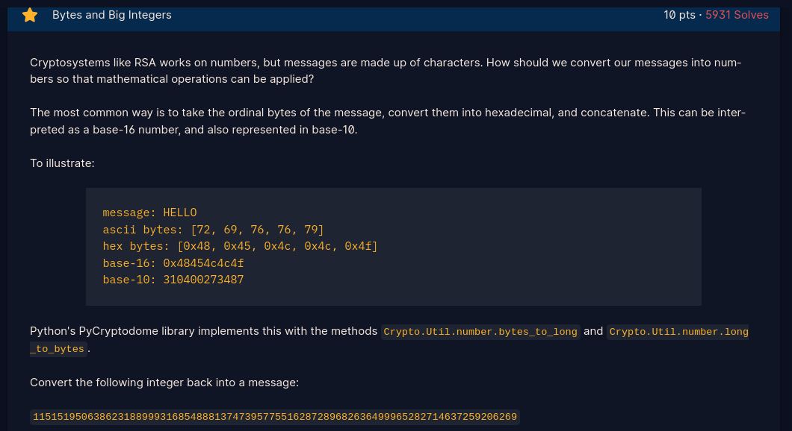
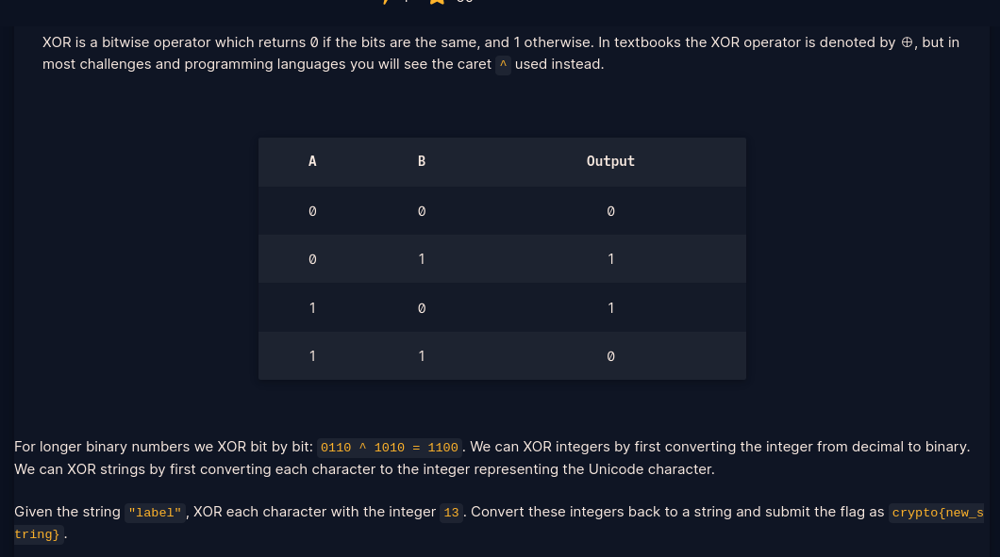
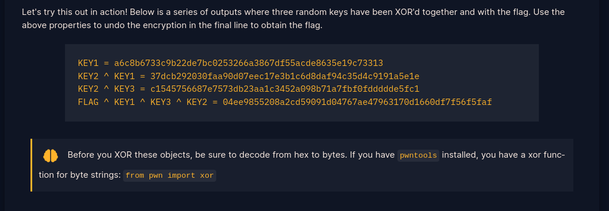

# Crypto
This repo will contain my learning journey as i learn and solve crypto day by day...
Feel free to comment, criticize and advise on my code....Thankyouuuu...😄😄😊😊
##### tags `Signup` `Introduction` `General`
### Writeups

<h1>Signup</h1>

We are presented with a ROT cipher. Replace value of a in:<a href="https://github.com/fesgic/Crypto/blob/main/Cryptohack.org/0.%20Signup/">signup;</a>

with your cipher. The script makes 25 iterations. Pick the one which makes sense.

<h1>Introduction<h1>
<h1>Network Attacks</h1>

- Send a json request {"buy":"flag"} over telnet connection to receive flag.

- Script provided here: <a href="https://github.com/fesgic/Crypto/blob/main/Cryptohack.org/1.%20Introduction/">Network Attacks</a>

<h1>General</h1>
<h2>Encoding</h2>
<h3>ASCII</h3>

- Read Array and convert to ascii to get flag. Script provided here:<a href="https://github.com/fesgic/Crypto/blob/main/Cryptohack.org/2.General/ASCII.py">Ascii</a> 

<h3>Hex</h3>

- There are several options:

- Use bytes.fromhex() to convert hex to bytes, then bytes.decode() to convert to Ascii to get the flag

- Use binascii library unhexlify to convert hex to bytes to get flag

Script provided here: <a href="https://github.com/fesgic/Crypto/blob/main/Cryptohack.org/2.General/hex.py">Hex</a>

<h3>Base64</h3>

- Decode hex to bytes, then encode to base64 and decode to ascii

 - Script provided here: <a href"https://github.com/fesgic/Crypto/blob/main/Cryptohack.org/2.General/encodebase.py">Base64</a>

<h3>Bytes and Big Intergers</h3>

- Import Crypto.Util.number 

- Use to_bytes() to convert to bytes

- Decode bytes to ascii to get flag

 - Script provided here: <a href="https://github.com/fesgic/Crypto/blob/main/Cryptohack.org/2.General/bytesbigint.py">Bytes and Big Intergers</a>

<h3>Encoding Challenge</h3>

<h2>XOR</h2>

Before starting XOR, here are a few things you should know:

-By default, when you <b>XOR</b> in python, values are converted into binary,

 then the bitwise operations are done</>
<h3>XOR Starter</h3>

<h4>Python</h4>

- Loop through the string and convert each character to unicode(ascii)

- XOR each character with the interger provided

- Convert result back to character from unicode represntation you get after xor

- Script is provided here: <a href="https://github.com/fesgic/Crypto/blob/main/Cryptohack.org/2.General/xorstarter.py">XOR starter</a>

<h4>Golang</h4>

-Golang works with strings in utf-8 encoding so there will be no need for conversion

-Simply loop  through each character xoring it with the interger provided, convert the bytes back to string to get the flag

- Golang Script provided here: <a href="https://github.com/fesgic/Crypto/blob/main/Cryptohack.org/2.General/xorstarter.go">XOR starter</a>

<h3>XOR Properties</h3>

-
