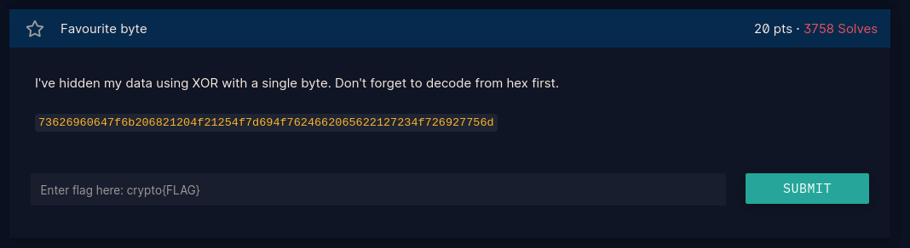
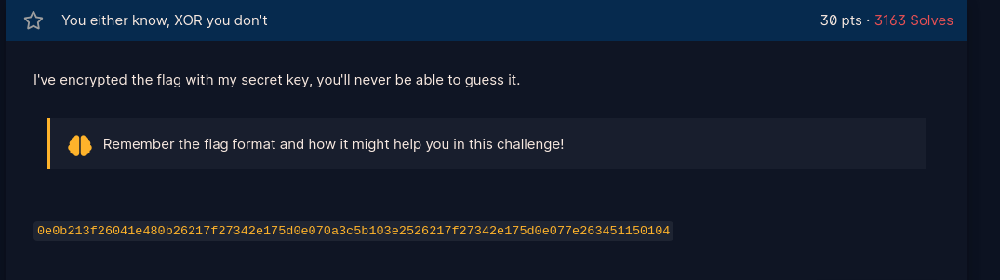
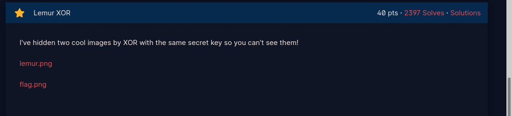
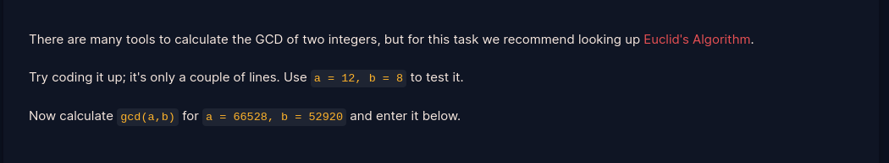

# Crypto
This repo will contain my learning journey as i learn and solve crypto day by day...
Feel free to comment, criticize and advise on my code....Thankyouuuu...😄😄😊😊
##### tags `Signup` `Introduction` `General`
### Writeups

<h1>Signup</h1>

We are presented with a ROT cipher. Replace value of a in:<a href="https://github.com/fesgic/Crypto/blob/main/Cryptohack.org/0.%20Signup/">signup;</a>

with your cipher. The script makes 25 iterations. Pick the one which makes sense.

<h1>Introduction<h1>
<h1>Network Attacks</h1>

- Send a json request {"buy":"flag"} over telnet connection to receive flag.

- Script provided here: <a href="https://github.com/fesgic/Crypto/blob/main/Cryptohack.org/1.%20Introduction/">Network Attacks</a>

<h1>General</h1>
<h2>Encoding</h2>
<h3>ASCII</h3>

- Read Array and convert to ascii to get flag. Script provided here:<a href="https://github.com/fesgic/Crypto/blob/main/Cryptohack.org/2.General/ASCII.py">Ascii</a> 

<h3>Hex</h3>

- There are several options:

- Use bytes.fromhex() to convert hex to bytes, then bytes.decode() to convert to Ascii to get the flag

- Use binascii library unhexlify to convert hex to bytes to get flag

Script provided here: <a href="https://github.com/fesgic/Crypto/blob/main/Cryptohack.org/2.General/hex.py">Hex</a>

<h3>Base64</h3>

- Decode hex to bytes, then encode to base64 and decode to ascii

 - Script provided here: <a href"https://github.com/fesgic/Crypto/blob/main/Cryptohack.org/2.General/encodebase.py">Base64</a>

<h3>Bytes and Big Intergers</h3>

- Import Crypto.Util.number 

- Use to_bytes() to convert to bytes

- Decode bytes to ascii to get flag

 - Script provided here: <a href="https://github.com/fesgic/Crypto/blob/main/Cryptohack.org/2.General/bytesbigint.py">Bytes and Big Intergers</a>

<h3>Encoding Challenge</h3>

<h2>XOR</h2>

Before starting XOR, here are a few things you should know:

-By default, when you <b>XOR</b> in python, values are converted into binary,

 then the bitwise operations are done</>
<h3>XOR Starter</h3>

<h4>Python</h4>

- Loop through the string and convert each character to unicode(ascii)

- XOR each character with the interger provided

- Convert result back to character from unicode represntation you get after xor

- Script is provided here: <a href="https://github.com/fesgic/Crypto/blob/main/Cryptohack.org/2.General/xorstarter.py">XOR starter</a>

<h4>Golang</h4>

-Golang works with strings in utf-8 encoding so there will be no need for conversion

-Simply loop  through each character xoring it with the interger provided, convert the bytes back to string to get the flag

- Golang Script provided here: <a href="https://github.com/fesgic/Crypto/blob/main/Cryptohack.org/2.General/xorstarter.go">XOR starter</a>

<h3>XOR Properties</h3>

-From the Properties of XOR, the associative property best applies here that is: 

 <t><t>Associative: A ⊕ (B ⊕ C) = (A ⊕ B) ⊕ C 

-In our case: 

(i)   Convert the hex to bytes

(ii)  Import xor from pwntools

(iii) XOR key2^key3 with key1

(iv)  XOR results above with flag^key1^key3^key2 to get flag

(v)   Decode the bytes to ascii

- Script provided here: <a href="https://github.com/fesgic/Crypto/blob/main/Cryptohack.org/2.General/xor_properties.py">XOR Properties</a>

<h3>Favourite Byte</h3>

-In utf-8 an unsigned in ranges from 0-256, and each has 8bits(1byte) from which one of them has been used to XOR our flag

(i)  Convert the hex data to data bytes

(ii) Declare the starting bytes at 0x00

(iii)Loop through range 0-256 xoring each data bytes with bytes in step(i)

(iv) Since we know our flag format, print out only when the string has part of the flag else go back to step3

- Script provide here: <a href="https://github.com/fesgic/Crypto/blob/main/Cryptohack.org/2.General/favourite_byte.py">Favourite Byte</a>

<h3>You either know, XOR you dont</h3>

<h3>Lemur XOR</h3>

- The two images are XORed with the same key

- From XOR Properties, if we XOR the two images with each other, they are bound to give the key used in xoring them

- Script provided here: <a href="https://github.com/fesgic/Crypto/blob/main/Cryptohack.org/2.General/lemurXor.sh">LemurXor</a>

<h2>Mathematics<h2>
<h3>Greatest Common Divisor</h3>

- For this task, i used <a href="https://en.wikipedia.org/wiki/Euclidean_algorithm#Description">Euclid's algorithm</a> as advised in the challenge. Found it pretty simple than expected btw...

- For easier understanging, please go through the following youtube video: <a href="https://youtu.be/cOwyHTiW4KE">The Trev Tutor- Euclidian algorithm</a>

- Basically, for any values (a,b): a = bq+r  and gcd(a,b) = gcd(b,r) 
e.g (5,2) = 2.2+1 
b = 2 r =1 
(2,1) = 2.1 + 0 
when r = 0, gcd will be equal to the value of b  
- For bigger numbers, repeat this recursively till r=0 .i.e while loop
- With this in mind, we can now script it <a href="https://github.com/fesgic/Crypto/blob/main/Cryptohack.org/2.General/Mathematics/gcd.py>Euclidean algorithm</a>

<h3>Extended GCD</h3>
